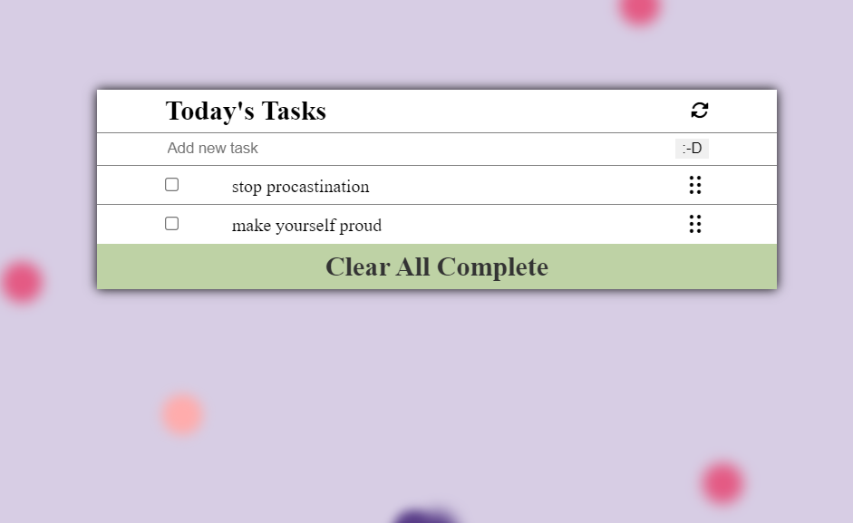

<!-- the change -->

  
    
  <h1><b>To do App</b></h1>

    
  
 

  

<!-- TABLE OF CONTENTS -->

# 📗 Table of Contents

- [📖 About the Project](#about-project)
  - [🛠 Built With](#built-with)
    - [Tech Stack](#tech-stack)
    - [Key Features](#key-features)
  - [🚀 Live Demo](#live-demo)
- [💻 Getting Started](#getting-started)
  - [Setup](#setup)
  - [Prerequisites](#prerequisites)
  - [Install](#install)
  - [Usage](#usage)
  - [Run tests](#run-tests)
  - [Deployment](#triangular_flag_on_post-deployment)
- [👥 Authors](#authors)
- [🔭 Future Features](#future-features)
- [🤝 Contributing](#contributing)
- [⭐️ Show your support](#support)
- [🙏 Acknowledgements](#acknowledgements)
- [❓ FAQ ](#faq)
- [📝 License](#license)

<!-- PROJECT DESCRIPTION -->

# 📖 Task-To-do 

> This Project for individual purpose it organize someone's task to do

**Task-To-do** is just a javascript based simple project
This is website for tracking your daily task completed or not , you can add ,delete edit and mark complete you tasks once you have finished all you can delete comlted atonce 

## 🛠 Built With 

### Tech Stack 

> In this project I used many skills, tech and libraries

  
Documentation

  <ul>
    <li><a href="https://html.com">HTML</a></li>
  </ul>

  
Styling

  <ul>
    <li><a href="https://www.w3.org">CSS</a></li>
  </ul>

Dynamics And Logics

  <ul>
    <li><a href="https://michalsnik.github.io/aos/">JavaScript</a></li>
  </ul>

<!-- 
 -->
<!-- 
Animation

  <ul>
    <li><a href="https://michalsnik.github.io/aos/">Aos.js</a></li>
  </ul>

 -->

<!-- Features -->

### Key Features 

> Following features you should observe

- **You can add your todays tasks**
- **yoc can checked the completed tasks**

(<a href="#readme-top">back to top</a>)

<!-- LIVE DEMO -->

## 🚀 Live Demo 

> This link will guide you to my project

- [Live Demo Link](https://powerlevel9000.github.io/Task-to-do-app/dist/)

(<a href="#readme-top">back to top</a>)

<!-- GETTING STARTED -->

## 💻 Getting Started 

>For having local file and project you can fork this repo 

>And for making changes you you should follow prerequisites

### Prerequisites

In order to edit this project you need:

 - Any text editor such as note pad and word pad
 - A web browser

#### suggested 
 - visual studio code
 - atom 
 - visual code 

### Setup

Clone this repository to your desired folder:

 - click on index.html
 - open in the browser

### Usage

 Execute the following thing:
 
 - See project buttons
 - Navigation bar on desktop version

### Run tests

- Check whether your fav book added 
- Check your mood swings works 🧑‍🏫😁 according to my project
 

### Deployment

You can deploy this project using:

- for this repo and use git hub pages to deploy it 

(<a href="#readme-top">back to top</a>)

<!-- AUTHORS -->

## 👥 Authors 

👤 **Adarsh Pathak**

- GitHub: [@PowerLevel9000](https://github.com/githubhandle)
- Twitter: [@PowerLevel9002](https://twitter.com/PowerLevel9002?t=AIuSN7mTxk5a_MWpLolEjA&s=09)
- LinkedIn: [@Adarsh Pathak](https://www.linkedin.com/in/adarsh-pathak-56a831256/)

<!-- FUTURE FEATURES -->

## 🔭 Future Features 

> Describe 1 - 3 features you will add to the project.

- [ ] **Add navigation bar**
- [ ] **improve functionality**
- [ ] **improve styling**

(<a href="#readme-top">back to top</a>)

<!-- CONTRIBUTING -->

## 🤝 Contributing 

Contributions, issues, and feature requests are welcome!

Feel free to check the [issues page](https://github.com/PowerLevel9000/Task-to-do-app/issues)).

(<a href="#readme-top">back to top</a>)

<!-- SUPPORT -->

## ⭐️ Show your support 

If you like my Project give it a Star ✨🌟 

(<a href="#readme-top">back to top</a>)

<!-- ACKNOWLEDGEMENTS -->

<!-- ## 🙏 Acknowledgments 

(<a href="#readme-top">back to top</a>)
 -->

<!-- FAQ (optional) -->

## ❓ FAQ 

> ask questions to be here 

- **[Question_1]**

  - [Answer_1]

- **[Question_2]**

  - [Answer_2]

(<a href="#readme-top">back to top</a>)

<!-- LICENSE -->

## 📝 License 

This project is [MIT](https://github.com/PowerLevel9000/Task-to-do-app/blob/devlopment/LICENSE) licensed.

(<a href="#readme-top">back to top</a>)

